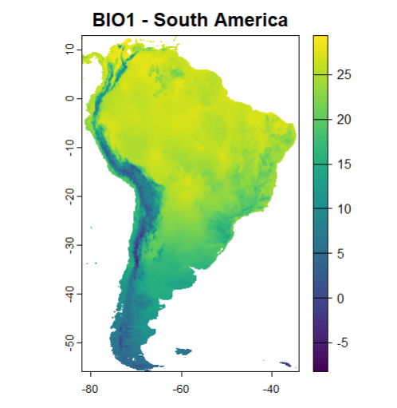
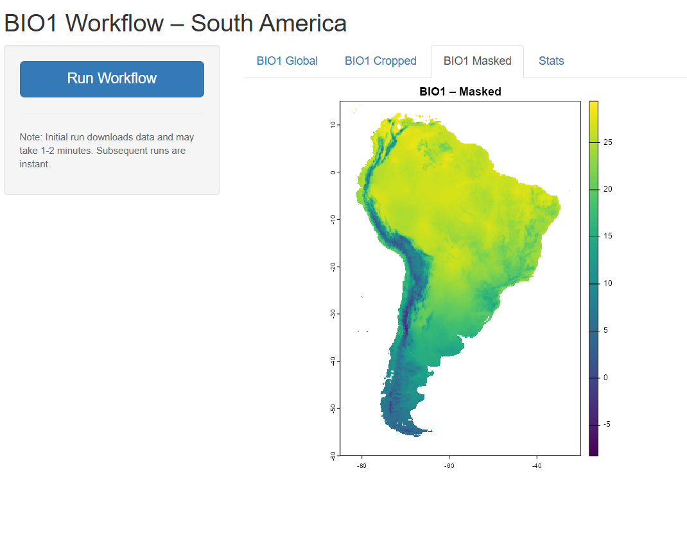

## Test Approaches

### Easy Test
A straightforward R script (`easy/easy-test.R`) that:
- Downloads global WorldClim BIO1 data
- Caches data locally (in `geodata_cache/` or R user cache directory)
- Crops data to South America extent
- Computes statistics (min, max, mean, std)
- Generates static plots for global and cropped views

### Medium Test
An interactive Shiny application (`medium/medium-test.R`) that:
- Provides a user-friendly web interface with tabbed output visualization
- Implements persistent caching with automatic fallback to system cache
- Adds advanced geospatial masking using continental boundary polygons
- Displays progress tracking during data processing
- Shows results across four tabs: Global, Cropped, Masked, and Statistics


## Dependencies

- `terra`: Raster data manipulation
- `geodata`: Climate data downloading
- `shiny`: Web application framework (Medium only)

## Running the Tests

```r
# Easy test
source("easy/easy-test.R")

# Medium test (launches Shiny app)
shiny::runApp("medium/medium-test.R")
```

## Results

### Easy Test Output


### Medium Test Output

